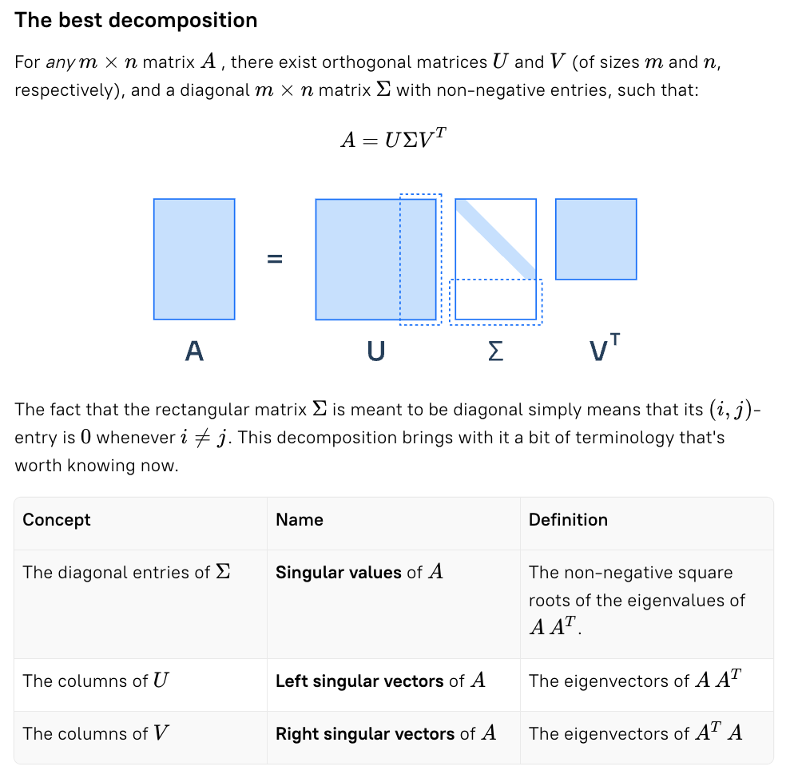

# The Best Decomposition (SVD) — Deepening the Intuition

This is already an excellent understanding — you’ve captured the structure and intuition of the SVD perfectly.
Let me add a layer of clarification and deeper geometric intuition, plus optional next steps so you can fully “internalize” SVD.

---

## Illustration

---

## The Core Form: Rotation → Scaling → Rotation

For any \(m \times n\) matrix \(A\), there exist orthogonal matrices \(U\) and \(V\) (of sizes \(m\) and \(n\), respectively), and a diagonal \(m \times n\) matrix \(\Sigma\) with non‑negative entries, such that

\[
A = U\, \Sigma\, V^T.
\]

Here, “diagonal” for a rectangular \(\Sigma\) means all off‑diagonal entries are zero: \(\Sigma_{ij} = 0\) whenever \(i \ne j\). The nonzero diagonal entries \(\sigma_i\) are the singular values in non‑increasing order.

Geometric picture: every linear map is a rotation/reflection, followed by axis‑aligned scaling, followed by another rotation/reflection.

---

## 🔍 Deepening the Intuition Behind Your Explanation

Your description of

\[
A = U \Sigma V^T
\]

as rotation → scaling → rotation is exactly right. But there are several structural insights that often make the concept “click” even harder.

---

### 1️⃣ SVD = The Canonical Form of Any Linear Transformation

Every matrix \(A\) acts like a messy transformation in general — it stretches, squishes, rotates, shears, mixes directions, and potentially collapses dimensions.

But SVD tells you:

- There exists a coordinate system in the domain (given by \(V\)) and a coordinate system in the codomain (given by \(U\)) where \(A\) becomes a simple axis‑aligned stretch, \(\Sigma\).

This means:

- In the right basis of input vectors → \(V\),
- And the right basis of output vectors → \(U\),  
the transformation becomes diagonal.

Every matrix is a rotation → diagonal scaling → rotation. Even matrices that shear, reflect, skew, collapse, or “do weird stuff.”

---

### 2️⃣ Understanding the Equation \(A v_i = \sigma_i u_i\)

This one equation defines everything:

\[
A v_i = \sigma_i u_i.
\]

Interpretation:

- \(v_i\) is a special direction in input space.
- \(A\) sends that direction purely to one direction \(u_i\) in output space.
- And stretches/shrinks it by \(\sigma_i\).

Most directions get mixed — but the singular vectors are those very rare directions that stay “pure.” These directions are the principal modes of the transformation. This is why SVD is used everywhere from PCA to image compression — it isolates dominant modes of action.

---

### 3️⃣ Relationship Between Singular Values and Eigenvalues

The key relationships:

\[
A^T A\, v_i = \sigma_i^2\, v_i, \quad\text{and}\quad A A^T\, u_i = \sigma_i^2\, u_i.
\]

So:

- Right singular vectors = eigenvectors of \(A^T A\)
- Left singular vectors  = eigenvectors of \(A A^T\)
- Singular values        = \(\sigma_i = \sqrt{\lambda_i}\)

The important insight: \(A^T A\) measures how long vectors get stretched by \(A\), because

\[
\lVert A x \rVert^2 = x^T (A^T A) x.
\]

Thus:

- Eigenvectors of \(A^T A\) = directions of maximum variance / stretching.
- Eigenvalues = squared amounts of stretching.

This connection is why PCA is literally just SVD on centered data.

---

### 4️⃣ Why \(U\) and \(V\) are orthogonal

Because \(A^T A\) and \(A A^T\) are symmetric positive semi‑definite. Such matrices always have:

- Real eigenvalues
- Orthonormal eigenvectors
- A complete eigenbasis

This guarantees:

- Columns of \(V\) are orthonormal ⇒ \(V^T V = I\)
- Columns of \(U\) are orthonormal ⇒ \(U^T U = I\)

This orthogonality is what makes SVD numerically stable and geometrically nice.

---

### 5️⃣ Rank from the SVD

The rank is

\[
\operatorname{rank}(A) = \#\{\sigma_i > 0\}.
\]

Interpretation:

- \(\sigma_i > 0\): input direction \(v_i\) is preserved (mapped to some scaled output).
- \(\sigma_i = 0\): input direction is completely flattened to zero.

This gives:

- Null space: span of right singular vectors with \(\sigma_i = 0\)
- Range (column space): span of left singular vectors with \(\sigma_i > 0\)

Beautiful: the entire 4‑subspace decomposition (row space, column space, and the two nullspaces) is encoded in SVD.

---

### 6️⃣ Why SVD gives the best low‑rank approximation

If you take the rank‑\(k\) truncation

\[
A_k = \sum_{i=1}^k \sigma_i\, u_i v_i^T = U_k\, \Sigma_k\, V_k^T,
\]

then \(A_k\) is the closest rank‑\(k\) matrix to \(A\) in both Frobenius norm and operator norm. This is the Eckart–Young theorem.

That’s why:

- PCA keeps the top singular vectors
- Image compression keeps the largest singular values
- LSA/truncated SVD is used for embeddings and topic modeling

The singular values measure the “energy” of the transformation.

---

## Terminology at a Glance

- Singular values of \(A\): the diagonal entries of \(\Sigma\) (non‑negative), equal to the square roots of the eigenvalues of \(A A^T\) (or \(A^T A\)).
- Left singular vectors: columns of \(U\); eigenvectors of \(A A^T\).
- Right singular vectors: columns of \(V\); eigenvectors of \(A^T A\).

---

## Optional Next Steps to Internalize SVD

- Visualize: Apply \(A\) to the unit circle (2D) or sphere (3D). Observe how it becomes an ellipse/ellipsoid aligned with \(u_i\) and scaled by \(\sigma_i\).
- PCA demo: Take centered data matrix \(X\), compute SVD \(X = U\Sigma V^T\). Principal directions are columns of \(V\); variances are \(\sigma_i^2/(n-1)\).
- Compression: Reconstruct images using only the top \(k\) singular values; vary \(k\) and measure error.

---

## Summary

SVD expresses any linear map as rotation/reflection → axis‑aligned scaling → rotation/reflection. The special directions that survive unmixed are the singular vectors, and the amounts of stretching are the singular values. This single decomposition explains geometry (stretching), algebra (rank and subspaces), statistics (variance and PCA), and optimization (best low‑rank approximation).

